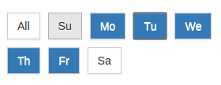

# ui-days-selector
Ui Days Selector using angular js and bootstrap

```
<days-selector is-show-all=true selected-days="selectedDays" after-toggle="afterToggle(selectedDays)"></days-selector>

```


