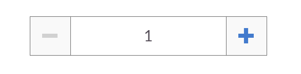

# ui-numberfield
AngularUI for AngularJS has implemented some Booststrap components in native AngularJS.

Angualat Ui Number Field 

```
Min & Max are optional
<number-field number-model="numberModel1"  min="-10" max="10"></number-field>

<number-field number-model="numberModel1"></number-field>
```


