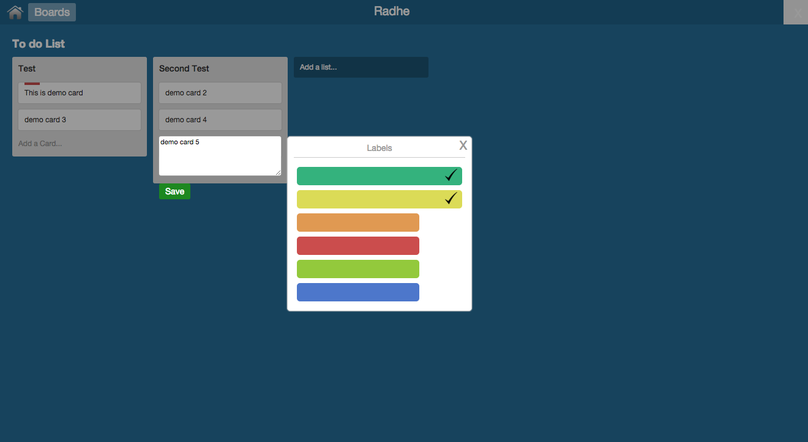
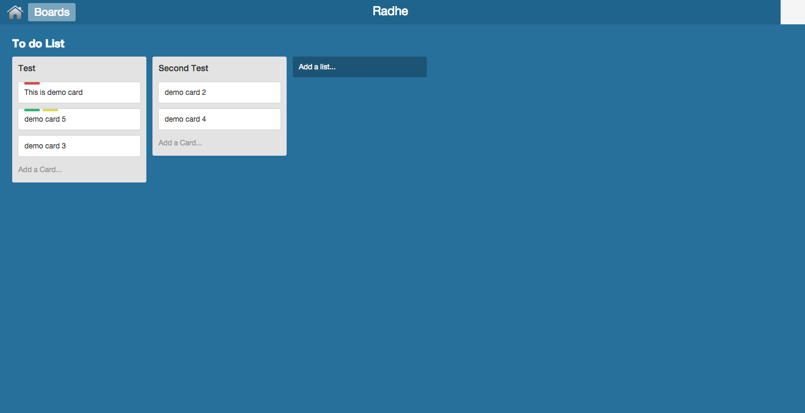

# trello using javascript and localstorage

```
	- All information related card, list, its labels, position and description are saved in localStorage
	- use local server (xampp or wamp) to run demo.
	- Used jquery and jqueryui for javascript libs
	- Used Mustache.js for templating
	- Used js prototype structure for page specific js
	- All methods and css are commented with proper description for future reference 
	
```



